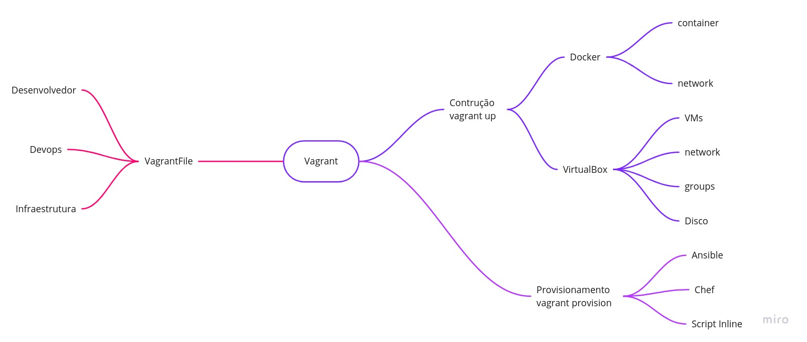
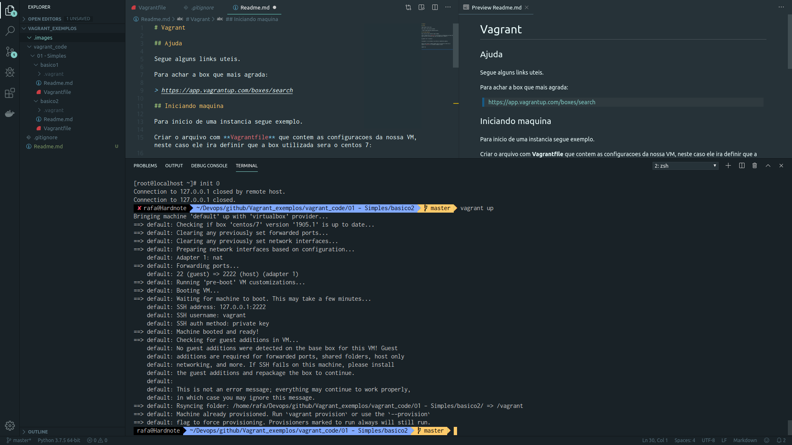

# Vagrant

Este repositorio vem para auxiliar na documentacao dos estudos referente a está solução da Hashicorp para provisionamento de recursos.

Muito fácil para construção de ambiente de Lab e POC.



## Conteudo

Alterando essa documentação para ficar mais dinamica, deixando tudo claro e objetivo.

Entendendo para que serve cada contexto e as suas evoluções iniciais.

**Boxes**

Uma Box é uma imagem já criada que pode ser baixada através do repositório de boxes na URL abaixo.

A box vem com tudo pronto, tanto a parte de particionamento quanto o sistema e a versão que voce deseja. Toda a parte de cofiguração de recursos como CPU, Memoria, Disco, Rede e entre outros vai ser configurado via código.

## Ajuda

Para achar a box que mais agrada:

> https://app.vagrantup.com/boxes/search

### Iniciando


Tudo começa pelo básico dentro do nosso projeto, dentro desses arquivos vai encontrar formas básicas de provisionamento de recursos no provider utilizando o vagrant.

1. Arquivos.
    * `[basico1](./vagrant_code/01-Basico/basico1/)` - Neste projeto voce irá subir um centos simples com apenas 3 linhas de código.

    * [basico2](./vagrant_code/01-Basico/basico2/) - Já neste possui uma customização da VM, como CPU, memória na nossa box.
  
    * [basico3](./vagrant_code/01-Basico/basico3/) - Neste podemos ver a criação de duas máquinas não utilizamos loop.

### Intermediario

2. Arquivos
    * [intermediario1](./vagrant_code/02-Intermediario/inter1/) - Usando variaveis para definicao de caracteristicas da VM.
    * [intermediario2](./vagrant_code/02-Intermediario/inter2/) - Começando a usar dicionarios e foreach.
    * [intermediario3](./vagrant_code/02-Intermediario/inter3/) - Crianco um grupo e armazenando as VM que será criandas dentro do mesmo.
    * [intermediario4](./vagrant_code/02-Intermediario/inter4/) - Trabalhando com array de variaveis, usando no foreach.
    * [intermediario5](./vagrant_code/02-Intermediario/inter5/) - Mesmo que os anteriores, adicionando discos dentro das VMs, criando estrutura de master e works.

### Outros

3. Arquivos
    * [avancado1](./vagrant_code/03-Avancado/avanc1/) - Explorando a função provisioning para execução após a criação das VMs.
    * [avancado2](./vagrant_code/03-Avancado/avanc2/) - Embedando um script no arquivo, executando ele inline após a criação das VMs
    
4. Arquivos
    * [Plugins](./vagrant_code/97-plugins/plug1) - ( EM CONSTRUÇÃO ).

5. Arquivos
    * [truque1](./vagrant_code/98-truques/truque01/)
      * Download sem checagem e criação de cluster redis com docker.
    * [truque2](./vagrant_code/98-truques/truque02/)
      * Criando com o for o cluster redis com docker.

6. Redes
    * [Redes](./vagrant_code/99-provision/) - ( EM CONSTRUÇÃO ).


**Observação**: Poderá desabilitar checagem de certificado para realização de download das boxes ( imagens ), com o parametro:

```
config.vm.box_download_insecure = true
```


## Ajuda

Segue alguns links uteis para achar a box que se adeque a sua necessidade:

> https://app.vagrantup.com/boxes/search

# Iniciando Projeto

Criar o arquivo com **Vagrantfile** que contem as configuracoes da nossa VM, neste caso ele ira definir que a box utilizada sera o centos 7:

```
$ vagrant init -m centos/7
```

O parametro -m e de minimal, nao contera os comentarios padroes.


Enfim, para iniciar a maquina apenas entre no diretorio de onde esta o arquivo **Vagrantfile** e levante a maquina virtual.

```
$ vagrant up
```



## Acesso a maquina

Para acesso com este comando: 

```
$ vagrant ssh
```

Pode verificar o status das máquinas :

```
$ vagrant status
```

Ou independente da localização do diretório que voce esteja:

```
$ vagrant global-status
id       name    provider   state    directory                                                                   
-----------------------------------------------------------------------------------------------------------------
a44814a  default virtualbox running /home/rafa/Devops/github/Vagrant_exemplos/vagrant_code/01 - Simples/basico2 
```

Uma maquina especifica:

``` 
$ vagrant ssh elastic01
```

ou 

```
$ vagrant ssh a44
```

## Desligando maquina

Para desligamento apenas digite no mesmo diretorio:

```
$ vagrant halt
```

Para desligar uma maquina especifica obtenha o ID:

```
$ vagrant global-status
id       name    provider   state    directory                                                                   
-----------------------------------------------------------------------------------------------------------------
a44814a  default virtualbox running /home/rafa/Devops/github/Vagrant_exemplos/vagrant_code/01 - Simples/basico2 
 
The above shows information about all known Vagrant environments
on this machine. This data is cached and may not be completely
up-to-date (use "vagrant global-status --prune" to prune invalid
entries). To interact with any of the machines, you can go to that
directory and run Vagrant, or you can use the ID directly with
Vagrant commands from any directory. For example:
"vagrant destroy 1a2b3c4d"
```

Executando:

```
$ vagrant halt a44
```

## Destruindo

Para destruicao execute:

```
$ vagrant destroy 
```

Ou uma maquina especifica:

```
$ vagrant destroy a444
```

Para nao perguntar se vc tem certeza de remover execute com parametro **-f**:

```
$ vagrant destroy -f 
```

## Conclusao

Uma ferramente de curto aprendizado e com muito resultado para POC, Lab, estudos e documentacao de infraestrutura.
